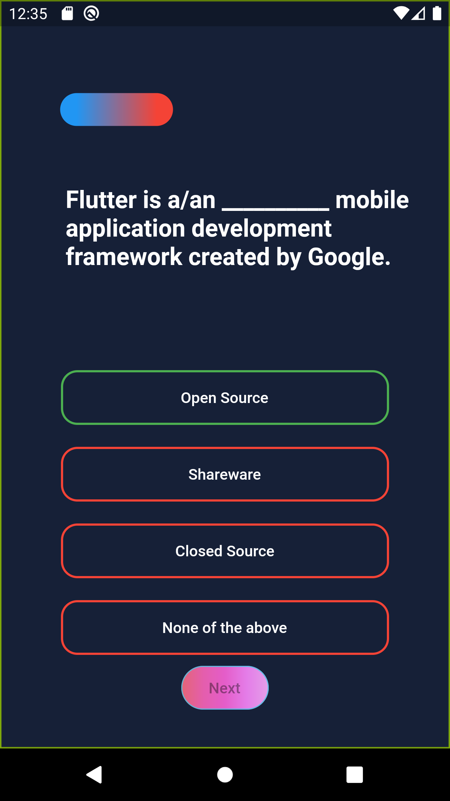
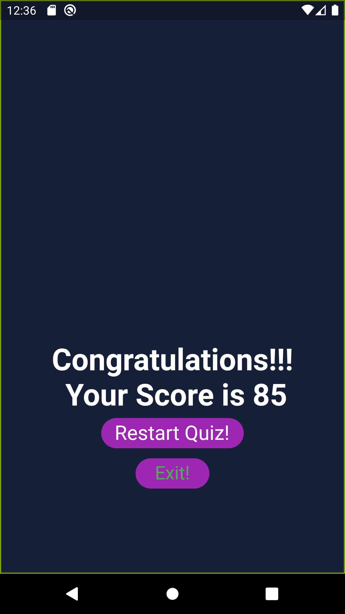

# flutter_quiz_app

A new Flutter application. :grinning: 

## Getting Started

This project is a starting point for a Flutter application.

 <table style="width:100%">
  <tr>
    <th></th>
    <th>Questions with Percent bar</th>
    <th></th>
  </tr>
  <tr>
    <td></td>
    <td></td>
    <td></td>
  </tr>
  <tr>
    <th>Green for right answer</th>
    <th></th>
    <th>Result</th>
  </tr>
  <tr>
    <td></td>
    <td></td>
    <td></td>
  </tr>
</table> 

:green_circle: Complete your flutter basics with widgets,state management and many more.
              Happy Learning :+1::thumbsup:

A few resources to get you started if this is your first Flutter project:

- [Lab: Write your first Flutter app](https://flutter.dev/docs/get-started/codelab)
- [Cookbook: Useful Flutter samples](https://flutter.dev/docs/cookbook)

For help getting started with Flutter, view our
[online documentation](https://flutter.dev/docs), which offers tutorials,
samples, guidance on mobile development, and a full API reference.

